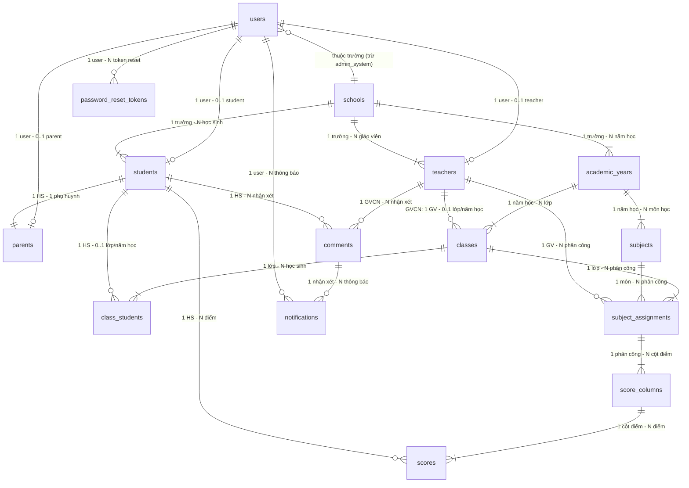

# TÀI LIỆU ERD – HỆ THỐNG QUẢN LÝ ĐIỂM HỌC SINH

---

## Thông tin tài liệu

| Mục | Nội dung |
|---|---|
| Tên dự án | Hệ thống Quản lý điểm học sinh |
| Tài liệu tham chiếu | BRD v1.1, SRS v1.1 |
| Người soạn | Business Analyst |
| Ngày tạo | 13/02/2026 |
| Phiên bản | 1.1 |

---

## 1. Tổng quan

Tài liệu này mô tả chi tiết mô hình dữ liệu (Entity Relationship Diagram) của Hệ thống Quản lý điểm học sinh. Tất cả entity, attribute và relationship được trích xuất trực tiếp từ BRD v1.1 và SRS v1.1.

### 1.1 Danh sách Entity

| STT | Entity | Mô tả | Nguồn tham chiếu |
|---|---|---|---|
| 1 | `users` | Tài khoản đăng nhập hệ thống (tất cả role) | BRD 3.1, SRS FR-001 |
| 2 | `schools` | Trường học | BRD 4.1.2, SRS FR-002 |
| 3 | `academic_years` | Năm học | BRD 4.2.1, SRS FR-003 |
| 4 | `subjects` | Môn học | BRD 4.2.2, SRS FR-004 |
| 5 | `teachers` | Giáo viên | BRD 4.2.3, SRS FR-005 |
| 6 | `students` | Học sinh | BRD 4.2.4, SRS FR-006 |
| 7 | `parents` | Phụ huynh | BRD 4.2.4, SRS FR-006 |
| 8 | `classes` | Lớp học | BRD 4.2.5, SRS FR-007 |
| 9 | `class_students` | Bảng trung gian: Học sinh thuộc lớp | BRD 4.2.6, SRS FR-008 |
| 10 | `subject_assignments` | Phân công giáo viên bộ môn cho lớp | BRD 4.2.7, SRS FR-009 |
| 11 | `score_columns` | Cột điểm (do GVBM tạo) | BRD 4.3.4, SRS FR-014 |
| 12 | `scores` | Điểm số của học sinh | BRD 4.3.4, SRS FR-014 |
| 13 | `comments` | Nhận xét học sinh (do GVCN tạo) | BRD 4.3.3, SRS FR-013 |
| 14 | `notifications` | Thông báo email gửi đến phụ huynh/học sinh | BRD 4.3.3, SRS FR-013 |
| 15 | `password_reset_tokens` | Token đặt lại mật khẩu (hiệu lực 15 phút) | BRD 3.2, SRS FR-018 |

---

## 2. ERD Diagram (Mermaid)



---

## 3. Chi tiết từng Entity

---

### 3.1 `users` – Tài khoản người dùng

**Mô tả:** Bảng chứa thông tin đăng nhập của tất cả người dùng trong hệ thống. Mỗi user được gắn với đúng 1 role.

**Nguồn:** BRD 2.3, 3.1, 4.1.1 | SRS FR-001, BR-001-01, BR-001-02, BR-001-03

| Tên cột | Kiểu dữ liệu | Nullable | Unique | Mô tả |
|---|---|---|---|---|
| `id` | UUID / BIGINT | NOT NULL | PK | Khóa chính, tự động sinh |
| `email` | VARCHAR(255) | NOT NULL | UQ | Email đăng nhập |
| `password` | VARCHAR(255) | NOT NULL | - | Mật khẩu (phải mã hóa khi lưu) |
| `role` | ENUM | NOT NULL | - | Vai trò: `admin_system`, `admin_school`, `teacher`, `parent`, `student` |
| `school_id` | FK → schools.id | NULL | - | Trường học liên kết. NULL nếu role = `admin_system` |
| `created_at` | TIMESTAMP | NOT NULL | - | Thời gian tạo |
| `updated_at` | TIMESTAMP | NOT NULL | - | Thời gian cập nhật |

**Constraints:**
- `PK`: `id`
- `UQ`: `email` (mỗi email chỉ dùng cho 1 tài khoản)
- `FK`: `school_id` → `schools.id`
- `CHECK`: `role` IN (`admin_system`, `admin_school`, `teacher`, `parent`, `student`)

**Seed Data:**
- Tài khoản Admin System mặc định (tạo sẵn khi khởi tạo hệ thống):
  - `email`: `adminstpoint@gmail.com`
  - `password`: `adminstpoiNt1122@` (phải mã hóa)
  - `role`: `admin_system`
  - `school_id`: `NULL`

**Business Rules liên quan:**
- BR-001-01: Phân quyền dựa trên `role`
- BR-001-02: Mỗi tài khoản gắn đúng 1 role
- BR-001-03: Tài khoản Admin System có email/password mặc định (xem Seed Data)
- BR-002-01: Khi tạo trường → tự động tạo 1 record user với role = `admin_school` và `school_id` = id trường vừa tạo

---

### 3.2 `schools` – Trường học

**Mô tả:** Bảng chứa thông tin các trường học được Admin System quản lý. Khi tạo trường, hệ thống tự động tạo tài khoản Admin School tương ứng.

**Nguồn:** BRD 4.1.2 | SRS FR-002

| Tên cột | Kiểu dữ liệu | Nullable | Unique | Mô tả |
|---|---|---|---|---|
| `id` | UUID / BIGINT | NOT NULL | PK | Khóa chính |
| `name` | VARCHAR(255) | NOT NULL | - | Tên trường học |
| `school_code` | VARCHAR(8) | NOT NULL | UQ | Mã trường – duy nhất toàn hệ thống, Admin System tự nhập. Tối đa 8 ký tự, chỉ chữ cái và chữ số |
| `created_at` | TIMESTAMP | NOT NULL | - | Thời gian tạo |
| `updated_at` | TIMESTAMP | NOT NULL | - | Thời gian cập nhật |

**Constraints:**
- `PK`: `id`
- `UQ`: `school_code` (mã trường unique toàn hệ thống)
- `CHECK`: `school_code` ~ `^[a-zA-Z0-9]{1,8}$` (chỉ chữ cái và chữ số, tối đa 8 ký tự)

**Business Rules liên quan:**
- BR-002-01: Khi INSERT vào `schools` → trigger tạo 1 record trong `users` với role = `admin_school` và `school_id` = id trường vừa tạo
- BR-002-02: `school_code` UNIQUE toàn hệ thống
- BR-002-03: `school_code` do Admin System tự nhập
- BR-002-04: `school_code` tối đa 8 ký tự, chỉ chữ cái và chữ số (regex: `^[a-zA-Z0-9]{1,8}$`)
- BR-002-05: Trước khi DELETE `schools` → kiểm tra `EXISTS` trong `teachers` và `students` theo `school_id`. Nếu có → trả lỗi, không cho phép xóa

> **Ghi chú Dev:** Xử lý BR-002-05 ở application-level (kiểm tra trước khi DELETE). Không dùng `ON DELETE CASCADE` để tránh xóa dữ liệu liên quan ngoài ý muốn.

> **Lưu ý:** BRD không đề cập chi tiết thông tin tài khoản Admin School được tạo tự động (email, password mặc định). Thông tin adminstpoint@gmail.com / adminstpoiNt1122@ là của Admin System, không phải Admin School. **Cần làm rõ cơ chế generate tài khoản Admin School với stakeholder.**

---

### 3.3 `academic_years` – Năm học

**Mô tả:** Bảng chứa danh sách năm học theo từng trường. Mỗi năm học có trạng thái vòng đời và chỉ cho phép tối đa 1 năm học "Đang diễn ra" tại 1 thời điểm trong cùng trường.

**Nguồn:** BRD 4.2.1 | SRS FR-003

| Tên cột | Kiểu dữ liệu | Nullable | Unique | Mô tả |
|---|---|---|---|---|
| `id` | UUID / BIGINT | NOT NULL | PK | Khóa chính |
| `school_id` | FK → schools.id | NOT NULL | - | Trường học sở hữu năm học này |
| `name` | VARCHAR(100) | NOT NULL | - | Tên năm học (VD: "2025-2026") |
| `start_date` | DATE | NOT NULL | - | Ngày bắt đầu |
| `end_date` | DATE | NOT NULL | - | Ngày kết thúc |
| `status` | ENUM | NOT NULL | - | `preparing` / `in_progress` / `completed` |
| `created_at` | TIMESTAMP | NOT NULL | - | Thời gian tạo |
| `updated_at` | TIMESTAMP | NOT NULL | - | Thời gian cập nhật |

**Constraints:**
- `PK`: `id`
- `FK`: `school_id` → `schools.id`
- `CHECK`: `end_date` > `start_date`
- `CHECK`: `status` IN (`preparing`, `in_progress`, `completed`)
- **UNIQUE PARTIAL INDEX** (Application-level hoặc DB trigger): Trong cùng `school_id`, chỉ tối đa 1 record có `status` = `in_progress`

**Mapping giá trị status:**

| Giá trị DB | Hiển thị UI (tiếng Việt) |
|---|---|
| `preparing` | Chuẩn bị diễn ra |
| `in_progress` | Đang diễn ra |
| `completed` | Đã kết thúc |

**Business Rules liên quan:**
- BR-003-01: `WHERE school_id = ? AND status = 'in_progress'` chỉ trả về tối đa 1 record

---

### 3.4 `subjects` – Môn học

**Mô tả:** Bảng chứa danh sách môn học theo từng năm học. Mỗi năm học có danh sách môn học riêng biệt.

**Nguồn:** BRD 4.2.2 | SRS FR-004

| Tên cột | Kiểu dữ liệu | Nullable | Unique | Mô tả |
|---|---|---|---|---|
| `id` | UUID / BIGINT | NOT NULL | PK | Khóa chính |
| `academic_year_id` | FK → academic_years.id | NOT NULL | - | Năm học sở hữu |
| `name` | VARCHAR(100) | NOT NULL | - | Tên môn học (VD: "Toán", "Văn") |
| `created_at` | TIMESTAMP | NOT NULL | - | Thời gian tạo |
| `updated_at` | TIMESTAMP | NOT NULL | - | Thời gian cập nhật |

**Constraints:**
- `PK`: `id`
- `FK`: `academic_year_id` → `academic_years.id`

> **Lưu ý:** BRD không đề cập ràng buộc trùng tên môn trong cùng năm học. Dev tự quyết định có thêm `UNIQUE(academic_year_id, name)` hay không.

**Business Rules liên quan:**
- BR-004-01: Mỗi năm học có danh sách môn học riêng → query luôn filter theo `academic_year_id`

---

### 3.5 `teachers` – Giáo viên

**Mô tả:** Bảng chứa thông tin profile giáo viên. Mỗi giáo viên liên kết 1:1 với 1 record trong bảng `users` (role = `teacher`).

**Nguồn:** BRD 4.2.3 | SRS FR-005

| Tên cột | Kiểu dữ liệu | Nullable | Unique | Mô tả |
|---|---|---|---|---|
| `id` | UUID / BIGINT | NOT NULL | PK | Khóa chính |
| `user_id` | FK → users.id | NOT NULL | UQ | Tài khoản đăng nhập tương ứng |
| `school_id` | FK → schools.id | NOT NULL | - | Trường đang công tác |
| `full_name` | VARCHAR(255) | NOT NULL | - | Họ và tên |
| `date_of_birth` | DATE | NOT NULL | - | Ngày sinh |
| `address` | VARCHAR(500) | NOT NULL | - | Địa chỉ |
| `citizen_id` | VARCHAR(20) | NOT NULL | UQ | Số CCCD – duy nhất toàn hệ thống |
| `teacher_code` | VARCHAR(50) | NOT NULL | UQ | Mã số giáo viên – duy nhất toàn hệ thống |
| `gender` | ENUM | NOT NULL | - | Giới tính |
| `work_status` | ENUM | NOT NULL | - | Trạng thái làm việc: `active` / `resigned` |
| `created_at` | TIMESTAMP | NOT NULL | - | Thời gian tạo |
| `updated_at` | TIMESTAMP | NOT NULL | - | Thời gian cập nhật |

**Constraints:**
- `PK`: `id`
- `FK`: `user_id` → `users.id`
- `FK`: `school_id` → `schools.id`
- `UQ`: `user_id` (quan hệ 1:1 với users)
- `UQ`: `citizen_id` (CCCD unique toàn hệ thống)
- `UQ`: `teacher_code` (Mã GV unique toàn hệ thống)

**Mapping giá trị work_status:**

| Giá trị DB | Hiển thị UI (tiếng Việt) |
|---|---|
| `active` | Đang làm việc |
| `resigned` | Đã nghỉ |

> **Lưu ý:** BRD không liệt kê giá trị cụ thể cho `gender`. Gợi ý: `male` / `female` / `other`.

**Business Rules liên quan:**
- BR-005-01: `citizen_id` UNIQUE
- BR-005-02: `teacher_code` UNIQUE
- BR-005-03: Khi tạo teacher → đồng thời tạo record `users` với role = `teacher`

---

### 3.6 `students` – Học sinh

**Mô tả:** Bảng chứa thông tin profile học sinh. Mỗi học sinh liên kết 1:1 với record `users` (role = `student`) và 1:1 với record `parents`.

**Nguồn:** BRD 4.2.4 | SRS FR-006

| Tên cột | Kiểu dữ liệu | Nullable | Unique | Mô tả |
|---|---|---|---|---|
| `id` | UUID / BIGINT | NOT NULL | PK | Khóa chính (auto-increment nội bộ) |
| `student_code` | VARCHAR(50) | NOT NULL | UQ | Mã học sinh – hệ thống tự tạo theo format: `[Mã trường][Năm nhập học][Số thứ tự]`. Ví dụ: `TH012025001`. Số thứ tự tăng dần, mỗi năm reset từ 1 |
| `user_id` | FK → users.id | NOT NULL | UQ | Tài khoản đăng nhập tương ứng |
| `school_id` | FK → schools.id | NOT NULL | - | Trường đang theo học |
| `full_name` | VARCHAR(255) | NOT NULL | - | Họ và tên |
| `date_of_birth` | DATE | NOT NULL | - | Ngày sinh |
| `address` | VARCHAR(500) | NOT NULL | - | Địa chỉ |
| `gender` | ENUM | NOT NULL | - | Giới tính |
| `study_status` | ENUM | NOT NULL | - | Trạng thái học tập: `studying` / `dropped_out` |
| `created_at` | TIMESTAMP | NOT NULL | - | Thời gian tạo |
| `updated_at` | TIMESTAMP | NOT NULL | - | Thời gian cập nhật |

**Constraints:**
- `PK`: `id`
- `UQ`: `student_code` (mã học sinh unique toàn hệ thống)
- `FK`: `user_id` → `users.id`
- `FK`: `school_id` → `schools.id`
- `UQ`: `user_id`

**Mapping giá trị study_status:**

| Giá trị DB | Hiển thị UI (tiếng Việt) |
|---|---|
| `studying` | Đang học |
| `dropped_out` | Đã nghỉ |

**Format `student_code`:**

```
[Mã trường] + [Năm nhập học] + [Số thứ tự tăng dần (3+ chữ số, zero-padded)]
```

- **Mã trường:** Lấy từ `schools.school_code` của trường mà học sinh thuộc về
- **Năm nhập học:** Năm hiện tại (4 chữ số) tại thời điểm tạo học sinh
- **Số thứ tự:** Tăng dần trong phạm vi trường + năm, reset lại từ 1 mỗi năm mới
- **Ví dụ:** Trường có mã `TH01`, năm 2025, học sinh thứ 1 → `TH012025001`

> **Ghi chú Dev:** Cần maintain bảng hoặc sequence riêng để tracking số thứ tự theo `(school_id, enrollment_year)`. Có thể dùng bảng `student_code_sequences(school_id, year, last_number)` hoặc query `MAX` trên `student_code`.

**Business Rules liên quan:**
- BR-006-01: `student_code` là duy nhất, hệ thống tự tạo theo format `[Mã trường][Năm nhập học][Số thứ tự]`. Số thứ tự reset mỗi năm
- BR-008-02: Khi lọc HS thêm vào lớp → `WHERE study_status = 'studying'`

---

### 3.7 `parents` – Phụ huynh

**Mô tả:** Bảng chứa thông tin phụ huynh. Mỗi phụ huynh gắn với 1 học sinh và có tài khoản đăng nhập riêng (role = `parent`).

**Nguồn:** BRD 4.2.4 | SRS FR-006

| Tên cột | Kiểu dữ liệu | Nullable | Unique | Mô tả |
|---|---|---|---|---|
| `id` | UUID / BIGINT | NOT NULL | PK | Khóa chính |
| `user_id` | FK → users.id | NOT NULL | UQ | Tài khoản đăng nhập phụ huynh |
| `student_id` | FK → students.id | NOT NULL | UQ | Học sinh liên kết (quan hệ 1:1) |
| `father_name` | VARCHAR(255) | NOT NULL | - | Họ tên cha |
| `father_occupation` | VARCHAR(255) | NOT NULL | - | Nghề nghiệp cha |
| `father_date_of_birth` | DATE | NOT NULL | - | Ngày sinh cha |
| `mother_name` | VARCHAR(255) | NOT NULL | - | Họ tên mẹ |
| `mother_occupation` | VARCHAR(255) | NOT NULL | - | Nghề nghiệp mẹ |
| `mother_date_of_birth` | DATE | NOT NULL | - | Ngày sinh mẹ |
| `mother_phone` | VARCHAR(20) | NOT NULL | - | Số điện thoại mẹ |
| `phone` | VARCHAR(20) | NOT NULL | - | Số điện thoại liên lạc chung |
| `created_at` | TIMESTAMP | NOT NULL | - | Thời gian tạo |
| `updated_at` | TIMESTAMP | NOT NULL | - | Thời gian cập nhật |

**Constraints:**
- `PK`: `id`
- `FK`: `user_id` → `users.id`
- `FK`: `student_id` → `students.id`
- `UQ`: `user_id`
- `UQ`: `student_id` (1 HS chỉ có 1 bản ghi PH)

> **Lưu ý:** BRD có đầy đủ thông tin ngày sinh và số điện thoại cho cả cha và mẹ.

**Business Rules liên quan:**
- BR-006-02: Thông tin phụ huynh lưu kèm học sinh → liên kết qua `student_id`
- BR-006-03: Phụ huynh có tài khoản riêng → `user_id` liên kết đến `users`

---

### 3.8 `classes` – Lớp học

**Mô tả:** Bảng chứa thông tin lớp học theo năm học. Mỗi lớp có 1 giáo viên chủ nhiệm. Tên lớp không trùng trong cùng năm học.

**Nguồn:** BRD 4.2.5 | SRS FR-007

| Tên cột | Kiểu dữ liệu | Nullable | Unique | Mô tả |
|---|---|---|---|---|
| `id` | UUID / BIGINT | NOT NULL | PK | Khóa chính |
| `academic_year_id` | FK → academic_years.id | NOT NULL | - | Năm học |
| `name` | VARCHAR(50) | NOT NULL | - | Tên lớp (VD: "10A1") |
| `homeroom_teacher_id` | FK → teachers.id | NOT NULL | - | Giáo viên chủ nhiệm |
| `created_at` | TIMESTAMP | NOT NULL | - | Thời gian tạo |
| `updated_at` | TIMESTAMP | NOT NULL | - | Thời gian cập nhật |

**Constraints:**
- `PK`: `id`
- `FK`: `academic_year_id` → `academic_years.id`
- `FK`: `homeroom_teacher_id` → `teachers.id`
- `UQ`: (`academic_year_id`, `name`) — Không trùng tên lớp trong cùng năm học
- `UQ`: (`academic_year_id`, `homeroom_teacher_id`) — 1 GV chỉ chủ nhiệm 1 lớp / năm học

**Business Rules liên quan:**
- BR-007-01: `UNIQUE(academic_year_id, name)`
- BR-007-02: `UNIQUE(academic_year_id, homeroom_teacher_id)`
- BR-007-03: Khi hiển thị dropdown GVCN → loại trừ GV đã có trong bảng `classes` cho cùng `academic_year_id`

---

### 3.9 `class_students` – Học sinh trong lớp

**Mô tả:** Bảng trung gian quản lý danh sách học sinh thuộc lớp. Mỗi học sinh chỉ thuộc 1 lớp trong cùng năm học.

**Nguồn:** BRD 4.2.6 | SRS FR-008

| Tên cột | Kiểu dữ liệu | Nullable | Unique | Mô tả |
|---|---|---|---|---|
| `id` | UUID / BIGINT | NOT NULL | PK | Khóa chính |
| `class_id` | FK → classes.id | NOT NULL | - | Lớp học |
| `student_id` | FK → students.id | NOT NULL | - | Học sinh |
| `created_at` | TIMESTAMP | NOT NULL | - | Thời gian thêm vào lớp |

**Constraints:**
- `PK`: `id`
- `FK`: `class_id` → `classes.id`
- `FK`: `student_id` → `students.id`
- `UQ`: (`class_id`, `student_id`) — Không thêm trùng HS trong cùng lớp

**Constraint đặc biệt (application-level):**
Mỗi `student_id` chỉ xuất hiện 1 lần trong tất cả các lớp của cùng năm học. Cách triển khai:
- **Option A:** Thêm cột `academic_year_id` vào bảng này + `UNIQUE(academic_year_id, student_id)`
- **Option B:** Kiểm tra tại application-level trước khi INSERT bằng query: `SELECT COUNT(*) FROM class_students cs JOIN classes c ON cs.class_id = c.id WHERE c.academic_year_id = ? AND cs.student_id = ?`

**Business Rules liên quan:**
- BR-008-01: 1 HS chỉ thuộc 1 lớp / năm học
- BR-008-02: Chỉ thêm HS có `study_status = 'studying'`

---

### 3.10 `subject_assignments` – Phân công giáo viên bộ môn

**Mô tả:** Bảng quản lý phân công giáo viên dạy môn nào cho lớp nào. Là bảng trung gian 3 chiều: Lớp – Môn – Giáo viên.

**Nguồn:** BRD 4.2.7 | SRS FR-009

| Tên cột | Kiểu dữ liệu | Nullable | Unique | Mô tả |
|---|---|---|---|---|
| `id` | UUID / BIGINT | NOT NULL | PK | Khóa chính |
| `class_id` | FK → classes.id | NOT NULL | - | Lớp học |
| `subject_id` | FK → subjects.id | NOT NULL | - | Môn học |
| `teacher_id` | FK → teachers.id | NOT NULL | - | Giáo viên bộ môn phụ trách |
| `created_at` | TIMESTAMP | NOT NULL | - | Thời gian phân công |
| `updated_at` | TIMESTAMP | NOT NULL | - | Thời gian cập nhật |

**Constraints:**
- `PK`: `id`
- `FK`: `class_id` → `classes.id`
- `FK`: `subject_id` → `subjects.id`
- `FK`: `teacher_id` → `teachers.id`

> **Lưu ý:** BRD không đề cập ràng buộc: 1 lớp 1 môn chỉ có 1 GV hay nhiều GV, 1 GV dạy tối đa mấy lớp. Nếu 1 lớp 1 môn chỉ 1 GV → thêm `UNIQUE(class_id, subject_id)`.

**Business Rules liên quan:**
- BR-009-01: Mỗi lớp có danh sách môn + GV phụ trách

---

### 3.11 `score_columns` – Cột điểm

**Mô tả:** Bảng định nghĩa các cột điểm do GVBM tạo cho mỗi phân công (lớp + môn). Mỗi cột điểm có hệ số riêng, dùng để tính ĐTB có trọng số.

**Nguồn:** BRD 4.3.4 | SRS FR-014

| Tên cột | Kiểu dữ liệu | Nullable | Unique | Mô tả |
|---|---|---|---|---|
| `id` | UUID / BIGINT | NOT NULL | PK | Khóa chính |
| `subject_assignment_id` | FK → subject_assignments.id | NOT NULL | - | Phân công (lớp + môn + GV) |
| `coefficient` | INT / DECIMAL | NOT NULL | - | Hệ số điểm (VD: 1, 2, 3) |
| `order` | INT | NOT NULL | - | Thứ tự hiển thị cột |
| `created_at` | TIMESTAMP | NOT NULL | - | Thời gian tạo |

**Constraints:**
- `PK`: `id`
- `FK`: `subject_assignment_id` → `subject_assignments.id`
- `CHECK`: `coefficient` > 0

> **Lưu ý:** BRD không đề cập: cột điểm có tên không, có bao nhiêu giá trị hệ số, số lượng cột tối đa. Dev cần confirm. Nếu cần tên cột → thêm trường `name VARCHAR(100)`.

**Business Rules liên quan:**
- BR-014-02: Mỗi cột điểm có hệ số riêng → `coefficient`

---

### 3.12 `scores` – Điểm số

**Mô tả:** Bảng chứa điểm của từng học sinh cho từng cột điểm. GVBM nhập/chỉnh sửa trực tiếp trên bảng (inline editing).

**Nguồn:** BRD 4.3.4 | SRS FR-014, FR-015

| Tên cột | Kiểu dữ liệu | Nullable | Unique | Mô tả |
|---|---|---|---|---|
| `id` | UUID / BIGINT | NOT NULL | PK | Khóa chính |
| `score_column_id` | FK → score_columns.id | NOT NULL | - | Cột điểm |
| `student_id` | FK → students.id | NOT NULL | - | Học sinh |
| `value` | DECIMAL(5,2) | NULL | - | Giá trị điểm. NULL = chưa nhập |
| `created_at` | TIMESTAMP | NOT NULL | - | Thời gian tạo |
| `updated_at` | TIMESTAMP | NOT NULL | - | Thời gian cập nhật |

**Constraints:**
- `PK`: `id`
- `FK`: `score_column_id` → `score_columns.id`
- `FK`: `student_id` → `students.id`
- `UQ`: (`score_column_id`, `student_id`) — Mỗi HS chỉ có 1 điểm cho mỗi cột

> **Lưu ý:** BRD không đề cập thang điểm (0-10 hay 0-100). Nếu thang 10 → thêm `CHECK(value >= 0 AND value <= 10)`.

**Công thức tính ĐTB (SRS FR-015, BR-015-01):**

```
ĐTB môn = SUM(scores.value × score_columns.coefficient) / SUM(score_columns.coefficient)
```

**Ví dụ minh họa:**

Giả sử học sinh có:
- 3 con điểm hệ số 1: lần lượt là 7, 8, 9
- 2 con điểm hệ số 2: lần lượt là 7, 9
- 1 con điểm hệ số 3: là 8

```
ĐTB = (7 + 8 + 9 + 2×(7 + 9) + 3×8) / (1 + 1 + 1 + 2 + 2 + 3)
     = (7 + 8 + 9 + 14 + 18 + 24) / 10
     = 80 / 10
     = 8.0
```

Trong đó `(1 + 1 + 1 + 2 + 2 + 3) = 10` là tổng hệ số.

```sql
-- Query tính ĐTB môn cho 1 HS trong 1 phân công
SELECT
    s.student_id,
    SUM(s.value * col.coefficient) / SUM(col.coefficient) AS average_score
FROM scores s
JOIN score_columns col ON s.score_column_id = col.id
WHERE col.subject_assignment_id = ?
  AND s.student_id = ?
  AND s.value IS NOT NULL
GROUP BY s.student_id;
```

**Business Rules liên quan:**
- BR-014-03: Inline editing → UPDATE `scores.value` trực tiếp, sau đó nhấn "Lưu"
- BR-014-04: Sau khi nhấn "Lưu" → hệ thống tính toán lại ĐTB
- BR-015-01: Công thức ĐTB có trọng số (weighted average)
- BR-015-02: ĐTB tính lại khi GVBM nhấn "Lưu"

---

### 3.13 `comments` – Nhận xét học sinh

**Mô tả:** Bảng chứa nhận xét do GVCN tạo cho học sinh. Nhận xét có thời gian gửi lên lịch trong tương lai, khi đến thời điểm hệ thống tự động gửi thông báo.

**Nguồn:** BRD 4.3.3 | SRS FR-013

| Tên cột | Kiểu dữ liệu | Nullable | Unique | Mô tả |
|---|---|---|---|---|
| `id` | UUID / BIGINT | NOT NULL | PK | Khóa chính |
| `teacher_id` | FK → teachers.id | NOT NULL | - | GVCN tạo nhận xét |
| `student_id` | FK → students.id | NOT NULL | - | Học sinh được nhận xét |
| `class_id` | FK → classes.id | NOT NULL | - | Lớp học (context nhận xét) |
| `content` | TEXT | NOT NULL | - | Nội dung nhận xét |
| `scheduled_at` | DATETIME | NOT NULL | - | Thời gian dự kiến gửi (tương lai) |
| `status` | ENUM | NOT NULL | - | `scheduled` / `sent` |
| `created_at` | TIMESTAMP | NOT NULL | - | Thời gian tạo |
| `updated_at` | TIMESTAMP | NOT NULL | - | Thời gian cập nhật |

**Constraints:**
- `PK`: `id`
- `FK`: `teacher_id` → `teachers.id`
- `FK`: `student_id` → `students.id`
- `FK`: `class_id` → `classes.id`
- `CHECK`: `status` IN (`scheduled`, `sent`)

**Mapping giá trị status:**

| Giá trị DB | Hiển thị UI |
|---|---|
| `scheduled` | Đã lên lịch |
| `sent` | Đã gửi |

**Business Rules liên quan:**
- BR-013-01: Khi INSERT → `status = 'scheduled'`
- BR-013-02: Chỉ UPDATE được khi `status = 'scheduled'`
- BR-013-03: System job kiểm tra `WHERE status = 'scheduled' AND scheduled_at <= NOW()` → gửi email thông báo đến email đã đăng ký của phụ huynh và học sinh
- BR-013-05: Sau khi gửi → `UPDATE status = 'sent'`
- BR-013-07: `ORDER BY created_at DESC` (mới nhất lên trước)

---

### 3.14 `notifications` – Thông báo

**Mô tả:** Bảng chứa thông báo email gửi đến phụ huynh và học sinh khi nhận xét được gửi. Hệ thống tự động tạo notification và gửi email khi comment chuyển trạng thái sang `sent`.

**Nguồn:** BRD 4.3.3 | SRS FR-013, FR-016, FR-017

| Tên cột | Kiểu dữ liệu | Nullable | Unique | Mô tả |
|---|---|---|---|---|
| `id` | UUID / BIGINT | NOT NULL | PK | Khóa chính |
| `user_id` | FK → users.id | NOT NULL | - | Người nhận thông báo (PH hoặc HS) |
| `comment_id` | FK → comments.id | NOT NULL | - | Nhận xét gốc |
| `email_to` | VARCHAR(255) | NOT NULL | - | Email người nhận (lấy từ users.email) |
| `email_subject` | VARCHAR(255) | NOT NULL | - | Tiêu đề email: "Nhận xét mới từ giáo viên" |
| `email_body` | TEXT | NOT NULL | - | Nội dung email: "Giáo viên vừa có nhận xét mới về học sinh, hãy truy cập hệ thống để xem chi tiết. Xin chân thành cảm ơn phụ huynh và học sinh đã quan tâm." |
| `is_sent` | BOOLEAN | NOT NULL | - | Email đã gửi thành công chưa (default: false) |
| `sent_at` | TIMESTAMP | NULL | - | Thời gian gửi email thành công |
| `created_at` | TIMESTAMP | NOT NULL | - | Thời gian tạo thông báo |

**Constraints:**
- `PK`: `id`
- `FK`: `user_id` → `users.id`
- `FK`: `comment_id` → `comments.id`
- `DEFAULT`: `is_sent = false`

**Business Rules liên quan:**
- BR-013-03: Khi comment được gửi → tạo 2 notification: 1 cho student (user), 1 cho parent (user) → gửi email đến email đã đăng ký
- BR-013-04: `email_subject` = "Nhận xét mới từ giáo viên"
- BR-013-08: `email_body` = "Giáo viên vừa có nhận xét mới về học sinh, hãy truy cập hệ thống để xem chi tiết. Xin chân thành cảm ơn phụ huynh và học sinh đã quan tâm."

---

### 3.15 `password_reset_tokens` – Token đặt lại mật khẩu

**Mô tả:** Bảng lưu token đặt lại mật khẩu do hệ thống tạo khi người dùng yêu cầu "Quên mật khẩu". Token có hiệu lực 15 phút, chỉ sử dụng được 1 lần.

**Nguồn:** BRD 3.2 | SRS FR-018

| Tên cột | Kiểu dữ liệu | Nullable | Unique | Mô tả |
|---|---|---|---|---|
| `id` | UUID / BIGINT | NOT NULL | PK | Khóa chính |
| `user_id` | FK → users.id | NOT NULL | - | Người dùng yêu cầu đặt lại mật khẩu |
| `token` | VARCHAR(255) | NOT NULL | UQ | Token ngẫu nhiên duy nhất |
| `expires_at` | TIMESTAMP | NOT NULL | - | Thời điểm hết hạn (= `created_at` + 15 phút) |
| `used_at` | TIMESTAMP | NULL | - | Thời điểm token đã được sử dụng. `NULL` = chưa dùng |
| `created_at` | TIMESTAMP | NOT NULL | - | Thời gian tạo |

**Constraints:**
- `PK`: `id`
- `FK`: `user_id` → `users.id`
- `UQ`: `token` (mỗi token là duy nhất)

**Business Rules liên quan:**
- BR-018-01: Token hết hiệu lực sau 15 phút (`expires_at <= NOW()`)
- BR-018-02: Sau khi dùng thành công → cập nhật `used_at = NOW()` (không dùng lại được)
- BR-018-06: Áp dụng cho tất cả role trong hệ thống

---

## 4. Tổng hợp quan hệ giữa các Entity

| STT | Quan hệ | Loại | Mô tả | Constraint |
|---|---|---|---|---|
| 1 | `schools` → `users` | 1:N | 1 trường có nhiều user | `users.school_id` FK |
| 2 | `schools` → `academic_years` | 1:N | 1 trường có nhiều năm học | `academic_years.school_id` FK |
| 3 | `schools` → `teachers` | 1:N | 1 trường có nhiều giáo viên | `teachers.school_id` FK |
| 4 | `schools` → `students` | 1:N | 1 trường có nhiều học sinh | `students.school_id` FK |
| 5 | `users` → `teachers` | 1:1 | 1 user (role teacher) ↔ 1 teacher | `teachers.user_id` UQ FK |
| 6 | `users` → `students` | 1:1 | 1 user (role student) ↔ 1 student | `students.user_id` UQ FK |
| 7 | `users` → `parents` | 1:1 | 1 user (role parent) ↔ 1 parent | `parents.user_id` UQ FK |
| 8 | `students` → `parents` | 1:1 | 1 học sinh ↔ 1 phụ huynh | `parents.student_id` UQ FK |
| 9 | `academic_years` → `subjects` | 1:N | 1 năm học có nhiều môn | `subjects.academic_year_id` FK |
| 10 | `academic_years` → `classes` | 1:N | 1 năm học có nhiều lớp | `classes.academic_year_id` FK |
| 11 | `teachers` → `classes` | 1:1 (per year) | 1 GV chủ nhiệm tối đa 1 lớp / năm | `classes` UQ(academic_year_id, homeroom_teacher_id) |
| 12 | `classes` ↔ `students` | N:N | Qua bảng `class_students` | `class_students` |
| 13 | `classes` ↔ `subjects` ↔ `teachers` | N:N:N | Qua bảng `subject_assignments` | `subject_assignments` |
| 14 | `subject_assignments` → `score_columns` | 1:N | 1 phân công có nhiều cột điểm | `score_columns.subject_assignment_id` FK |
| 15 | `score_columns` → `scores` | 1:N | 1 cột điểm có nhiều điểm (mỗi HS) | `scores.score_column_id` FK |
| 16 | `students` → `scores` | 1:N | 1 HS có nhiều điểm | `scores.student_id` FK |
| 17 | `teachers` → `comments` | 1:N | 1 GVCN tạo nhiều nhận xét | `comments.teacher_id` FK |
| 18 | `students` → `comments` | 1:N | 1 HS nhận nhiều nhận xét | `comments.student_id` FK |
| 19 | `comments` → `notifications` | 1:N | 1 nhận xét tạo N thông báo (PH + HS) | `notifications.comment_id` FK |
| 20 | `users` → `notifications` | 1:N | 1 user nhận nhiều thông báo | `notifications.user_id` FK |
| 21 | `users` → `password_reset_tokens` | 1:N | 1 user có nhiều token reset (mỗi lần yêu cầu tạo 1 token mới) | `password_reset_tokens.user_id` FK |

---

## 5. Index gợi ý (cho Dev tham khảo)

Dựa trên các query pattern thường gặp từ BRD/SRS:

| Bảng | Index | Lý do |
|---|---|---|
| `schools` | `idx_schools_name` (`name`) | Tìm kiếm trường theo tên |
| `schools` | `idx_schools_school_code` (`school_code`) | Tìm kiếm trường theo mã trường |
| `users` | `idx_users_email` | Đăng nhập bằng email |
| `users` | `idx_users_school_role` (`school_id`, `role`) | Lọc user theo trường + role |
| `academic_years` | `idx_ay_school_status` (`school_id`, `status`) | Tìm năm học đang diễn ra của trường |
| `subjects` | `idx_subjects_ay` (`academic_year_id`) | Lọc môn theo năm học |
| `teachers` | `idx_teachers_school` (`school_id`) | Lọc GV theo trường |
| `teachers` | `idx_teachers_citizen_id` | Tìm kiếm theo CCCD |
| `students` | `idx_students_school_status` (`school_id`, `study_status`) | Lọc HS đang học theo trường |
| `classes` | `idx_classes_ay` (`academic_year_id`) | Lọc lớp theo năm học |
| `class_students` | `idx_cs_class` (`class_id`) | Lọc HS trong lớp |
| `class_students` | `idx_cs_student` (`student_id`) | Tìm lớp của HS |
| `subject_assignments` | `idx_sa_class` (`class_id`) | Lọc phân công theo lớp |
| `subject_assignments` | `idx_sa_teacher` (`teacher_id`) | Lọc phân công theo GV |
| `scores` | `idx_scores_column` (`score_column_id`) | Lọc điểm theo cột |
| `scores` | `idx_scores_student` (`student_id`) | Lọc điểm theo HS |
| `comments` | `idx_comments_student_created` (`student_id`, `created_at DESC`) | Lịch sử nhận xét, mới nhất trước |
| `comments` | `idx_comments_status_scheduled` (`status`, `scheduled_at`) | System job tìm nhận xét cần gửi |
| `notifications` | `idx_notif_user_read` (`user_id`, `is_read`) | Hiển thị thông báo chưa đọc |
| `password_reset_tokens` | `idx_prt_token` (`token`) | Tra cứu token khi người dùng click link reset |
| `password_reset_tokens` | `idx_prt_user` (`user_id`) | Tìm token theo user |

---

## 6. Các điểm cần Dev lưu ý

| STT | Nội dung | Trạng thái |
|---|---|---|
| ~~1~~ | ~~Bảng `schools` thiếu field chi tiết~~ | **Đã giải đáp:** Thêm `school_code` (mã trường, unique, tự nhập) |
| ~~2~~ | ~~Enum `work_status`, `study_status` chưa có giá trị cụ thể~~ | **Đã giải đáp:** `work_status`: active/resigned. `study_status`: studying/dropped_out |
| 3 | Enum `gender` chưa có giá trị cụ thể | Chưa rõ – gợi ý male/female/other |
| 4 | Thang điểm (`scores.value`) chưa xác định | Chưa rõ – BRD không đề cập (0-10 hay 0-100) |
| 5 | Giá trị `coefficient` chưa rõ phạm vi | Chưa rõ – BRD không liệt kê (1, 2, 3...) |
| 6 | Cột `score_columns` có cần trường `name` không | Chưa rõ – BRD không đề cập |
| 7 | Ràng buộc 1 HS / 1 lớp / năm học cần xử lý ở application-level hoặc thêm cột | Xem ghi chú tại `class_students` |
| 8 | Ràng buộc chỉ 1 năm học `in_progress` / trường cần partial unique index hoặc trigger | DB-specific implementation |
| ~~9~~ | ~~Kênh gửi notification (in-app, email, push) chưa rõ~~ | **Đã giải đáp:** Gửi qua email đã đăng ký của phụ huynh và học sinh |
| 10 | Tài khoản Admin School tạo tự động: email/password mặc định chưa rõ | Chưa rõ – cần confirm stakeholder (adminstpoint@gmail.com là của Admin System) |

---

*Kết thúc tài liệu ERD v1.1*
