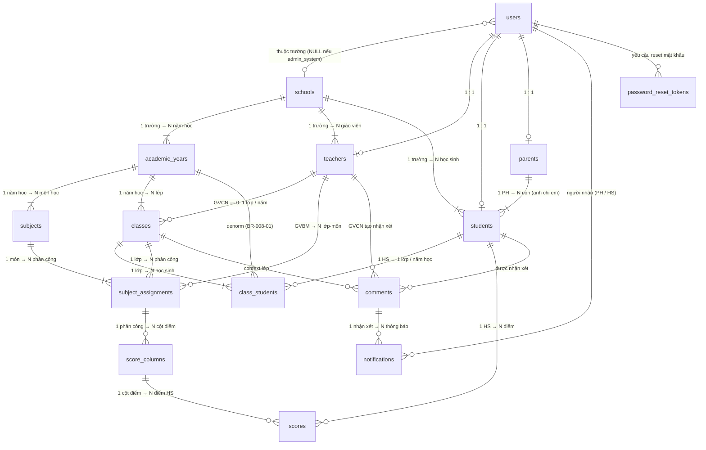
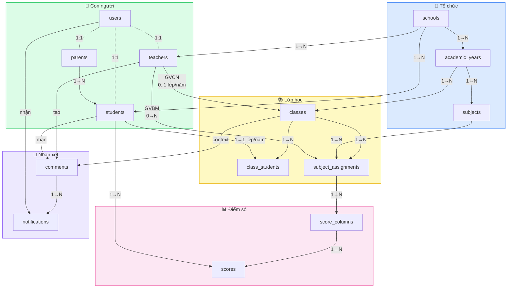

# Database Design — Overview (Quan hệ giữa các bảng)

> Chú thích ký hiệu:
> - `||——||` = 1 : 1
> - `||——|{` = 1 : N (bắt buộc)
> - `||——o{` = 1 : 0..N (có thể không có)
> - `||——o|` = 1 : 0..1 (có thể không có)
> - `}o——||` = N : 1 (optional bên N)

---

## Sơ đồ tổng thể

---

## Luồng dữ liệu theo nghiệp vụ

---

## Bảng tóm tắt quan hệ

| Từ | Đến | Quan hệ | Ghi chú |
|----|-----|---------|---------|
| `users` | `schools` | N : 0..1 | NULL nếu admin_system |
| `users` | `teachers` | **1 : 1** | |
| `users` | `students` | **1 : 1** | |
| `users` | `parents` | **1 : 1** | |
| `schools` | `academic_years` | **1 : N** | |
| `schools` | `teachers` | **1 : N** | |
| `schools` | `students` | **1 : N** | |
| `academic_years` | `subjects` | **1 : N** | môn theo năm |
| `academic_years` | `classes` | **1 : N** | |
| `parents` | `students` | **1 : N** | anh/chị/em |
| `teachers` | `classes` | 1 : 0..N | qua homeroom_teacher_id (GVCN) |
| `classes` | `class_students` | **1 : N** | junction |
| `students` | `class_students` | 1 : 0..N | 1 HS / 1 lớp / năm (unique) |
| `classes` | `subject_assignments` | **1 : N** | |
| `subjects` | `subject_assignments` | **1 : N** | |
| `teachers` | `subject_assignments` | 1 : 0..N | GVBM |
| `subject_assignments` | `score_columns` | 1 : 0..N | |
| `score_columns` | `scores` | 1 : 0..N | |
| `students` | `scores` | 1 : 0..N | |
| `teachers` | `comments` | 1 : 0..N | GVCN tạo |
| `students` | `comments` | 1 : 0..N | |
| `classes` | `comments` | 1 : 0..N | context |
| `comments` | `notifications` | 1 : 0..N | |
| `users` | `notifications` | 1 : 0..N | người nhận |
| `users` | `password_reset_tokens` | 1 : 0..N | |
